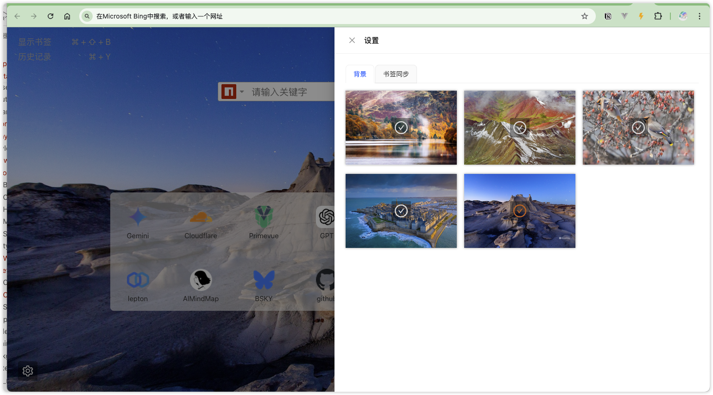

# ntab

自定义tab 导航页，自定义搜索，效果如下




# 使用方法

## 本地构建
clone 代码库到本地

```shell
pnpm install

pnpm build

pnpm zip

```


## 在chrome/chromium 中加载


## 最近更新

### v 1.5
[feat] 使用 Bing 图片 API 加载背景图片

### v 1.4
[feat] 导航地址同步到书签中


# 其他

bing 图片 API 使用的是 https://www.dailybing.com/api

欢迎 PR star